# Dev Workstation Mission

## 1. 프로젝트 개요

이번 과제에서는 리눅스 CLI, Docker, Git/GitHub를 사용해 개발 워크스테이션을 직접 구성하고 검증했다.  
터미널 기본 조작, 파일 및 디렉토리 권한 변경, Docker 설치 및 점검, 컨테이너 실행 및 관리, Dockerfile 기반 커스텀 이미지 제작, 포트 매핑, 바인드 마운트, Docker volume 영속성, Git 설정과 GitHub/VSCode 연동까지 수행했다.

핵심 목표는 단순히 명령어를 따라 치는 것이 아니라, 실행 결과와 스크린샷을 통해 **재현 가능한 개발 환경 구성**을 증명하고 각 도구의 역할을 설명할 수 있는 상태가 되는 것이다.

---

## 2. 실행 환경

- **OS**: Windows + Ubuntu (WSL)
- **Shell**: bash
- **Editor**: Visual Studio Code
- **Container Runtime**: Docker
- **Version Control**: Git
- **Remote Repository**: GitHub

---

## 3. 폴더 구조

```text
dev-workstation/
├─ app/
│  └─ index.html
├─ docs/
│  └─ screenshots/
├─ practice/
│  ├─ bind-mount/
│  │  └─ index.html
│  ├─ permissions/
│  │  ├─ dir-perm/
│  │  └─ file-perm.txt
│  ├─ terminal/
│  │  └─ cli-lab/
│  │     ├─ empty.txt
│  │     └─ note.txt
│  └─ volume/
├─ .gitignore
├─ Dockerfile
└─ README.md
```

---

## 4. 수행 체크리스트

- [x] 터미널 기본 조작
- [x] 파일 내용 확인
- [x] 파일/디렉토리 권한 실습
- [x] Docker 설치 및 기본 점검
- [x] Docker 기본 운영 명령 확인
- [x] `hello-world` 실행
- [x] Ubuntu 컨테이너 실행 및 내부 명령 수행
- [x] Dockerfile 기반 커스텀 웹 서버 이미지 빌드
- [x] 포트 매핑 후 브라우저 접속 확인
- [x] 바인드 마운트 반영 확인
- [x] Docker volume 영속성 검증
- [x] Git 사용자 정보 및 기본 브랜치 설정
- [x] VSCode GitHub 로그인 및 저장소 연동 확인
- [x] 보안 및 개인정보 보호 점검

---

## 5. 터미널 기본 조작

터미널에서 현재 위치 확인, 디렉토리 생성, 이동, 파일 생성, 복사, 이름 변경, 이동, 삭제를 수행했다.

### 실행 예시

```bash
mkdir cli-lab
cd cli-lab
touch empty.txt
echo "hello codyssey" > note.txt
cp note.txt note-copy.txt
mv note-copy.txt renamed-note.txt
mkdir temp-dir
mv renamed-note.txt temp-dir/
ls -la
ls -la temp-dir
rm temp-dir/renamed-note.txt
rmdir temp-dir
ls -la
pwd
```

### 확인한 내용

- `empty.txt` 빈 파일 생성
- `note.txt` 생성 및 내용 작성
- 파일 복사, 이름 변경, 이동, 삭제 수행
- `ls -la`로 숨김 파일 포함 목록 확인
- `pwd`로 현재 작업 위치 확인

### 스크린샷

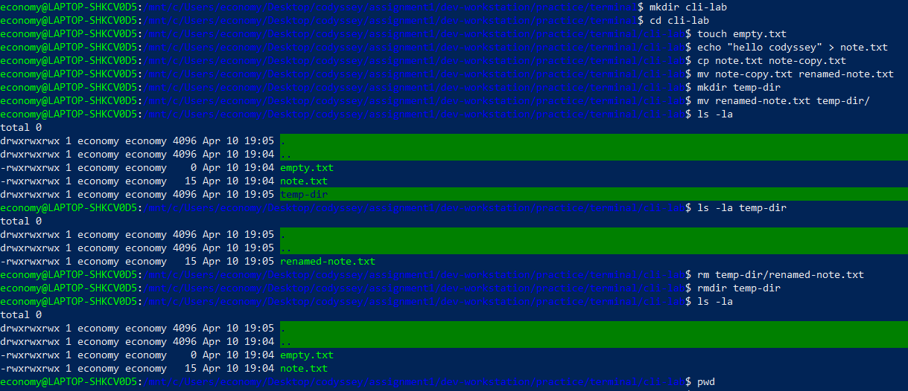

---

## 6. 파일 내용 확인 (`cat`)

생성한 파일의 내용을 `cat` 명령으로 확인했다.

### 실행 예시

```bash
cd /mnt/c/Users/economy/Desktop/codyssey/assignment1/dev-workstation/practice/terminal/cli-lab
cat note.txt
```

### 출력

```text
hello codyssey
```

### 확인한 내용

생성한 텍스트 파일 내용을 터미널에서 직접 확인했다.

### 스크린샷

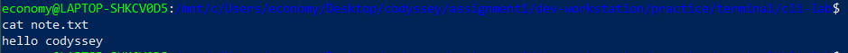

---

## 7. 절대 경로와 상대 경로

절대 경로는 루트부터 전체 위치를 모두 적는 방식이다.

### 예시

```text
/mnt/c/Users/economy/Desktop/codyssey/assignment1/dev-workstation
/mnt/c/Users/economy/Desktop/codyssey/assignment1/dev-workstation/practice/terminal/cli-lab/note.txt
```

상대 경로는 현재 작업 디렉토리를 기준으로 적는 방식이다.

### 예시

```text
practice/terminal/cli-lab/note.txt
practice/bind-mount/index.html
app/index.html
```

### 정리

- 절대 경로는 현재 위치와 상관없이 항상 같은 대상을 가리킨다.
- 상대 경로는 현재 작업 위치에 따라 의미가 달라진다.

---

## 8. 파일 및 디렉토리 권한 실습

파일과 디렉토리의 권한을 확인하고 변경하는 실습을 수행했다.

### 실행 예시

```bash
mkdir -p permission-lab
cd permission-lab
echo "permission test" > file-perm.txt
ls -l file-perm.txt
chmod 644 file-perm.txt
ls -l file-perm.txt
chmod 600 file-perm.txt
ls -l file-perm.txt

mkdir dir-perm
ls -ld dir-perm
chmod 755 dir-perm
ls -ld dir-perm
chmod 700 dir-perm
ls -ld dir-perm
```

### 권한 의미

- `r`: read
- `w`: write
- `x`: execute

### 숫자 권한 해석

- `644` = 소유자 `rw-`, 그룹 `r--`, 기타 `r--`
- `600` = 소유자 `rw-`, 그룹 `---`, 기타 `---`
- `755` = 소유자 `rwx`, 그룹 `r-x`, 기타 `r-x`
- `700` = 소유자 `rwx`, 그룹 `---`, 기타 `---`

### 확인한 내용

- 644의 각 숫자는 소유자 / 그룹 / 기타 각각의 권한값을 말한다.
- 각각 r=4, w=2, x=1의 값을 갖고있다.

### 스크린샷

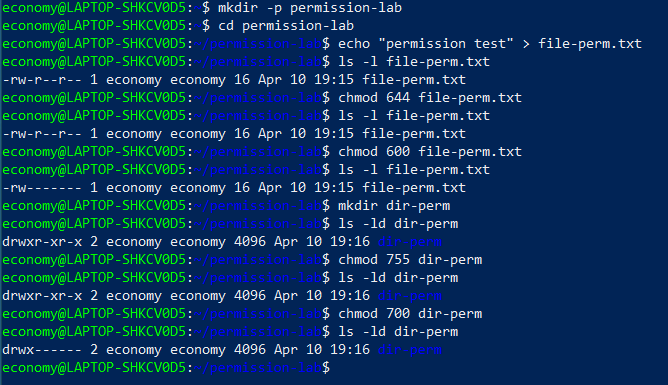

---

## 9. Docker 설치 및 기본 점검

Docker 설치 여부와 데몬 동작 여부를 확인했다.

### 실행 예시

```bash
docker --version
docker info
```

### 확인한 내용

- Docker CLI 버전 출력 확인
- Docker client 및 daemon 정보 확인

### 스크린샷

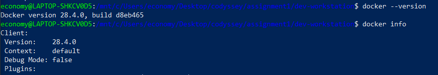

---

## 10. Docker 기본 운영 명령 확인

이미지, 컨테이너, 로그, 리소스 상태를 확인하는 기본 명령을 수행했다.

### 실행 예시

```bash
docker images
docker ps
docker ps -a
docker logs ubuntu-cli
docker stats --no-stream
```

### 확인한 내용

- 로컬 이미지 목록 확인
- 실행 중/종료된 컨테이너 목록 확인
- 컨테이너 로그 확인
- 컨테이너 리소스 사용량 확인

### 스크린샷

.PNG)
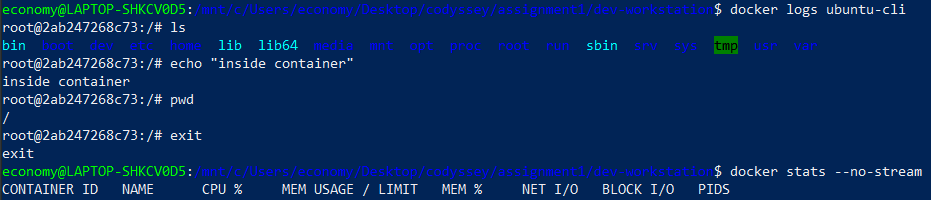

---

## 11. `hello-world` 및 Ubuntu 컨테이너 실행

Docker가 정상 동작하는지 확인하기 위해 `hello-world` 컨테이너를 실행했다.  
이후 Ubuntu 컨테이너를 실행하고 내부에서 간단한 명령을 수행했다.

### 실행 예시

```bash
docker run hello-world

docker run -it --name ubuntu-cli ubuntu bash
ls
echo "inside container"
pwd
exit
```

### 확인한 내용

- `hello-world` 메시지 출력 확인
- docker run의 의미는 해당하는 이미지를 가지는 컨테이너를 만들어서 실행시킨다.
- Ubuntu 컨테이너 내부 파일 시스템 확인
- 문자열 출력 및 현재 경로 확인
- rmi -> 이미지 삭제
- rm (-f) -> 컨테이너 삭제(강제 중지 후 삭제)
- docker image는 읽기 전용이므로 그대로이고, container가 image 위에 쓰기 레이어를 하나 얹어서 변경된 것처럼 보인다

### 스크린샷

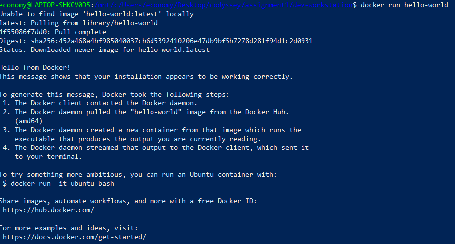
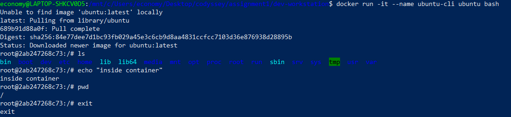
.PNG)

### `attach`와 `exec` 차이

- `docker attach`는 기존 컨테이너의 메인 프로세스에 직접 연결하는 방식이다.
- `docker exec -it <컨테이너명> bash`는 실행 중인 컨테이너 안에서 새로운 셸 프로세스를 실행하는 방식이다.

이번 실습에서는 컨테이너 내부에서 명령을 직접 실행하고 확인하기 위해 `exec` 방식이 더 편리했다.

---

## 12. Git 설정 및 GitHub/VSCode 연동

Git 사용자 정보와 기본 브랜치를 설정한 뒤, VSCode에서 GitHub 로그인 및 저장소 연동을 확인했다.

### 실행 예시

```bash
git config --global user.name "Economy0326"
git config --global user.email "마스킹 처리"
git config --global init.defaultBranch main
git config --list
```

### 확인한 내용

- Git 사용자 이름 설정 확인
- Git 이메일 설정 확인
- 기본 브랜치 `main` 설정 확인
- VSCode GitHub 로그인 및 저장소 연결 확인
- git init은 현재 디렉토리에 .git이라는 숨김 폴더(디렉토리) 를 만들어서 그 폴더를 Git 저장소로 초기화하는 명령

### 스크린샷

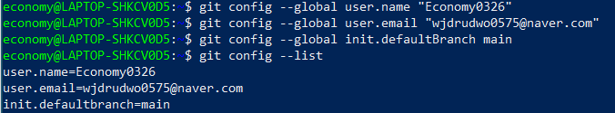
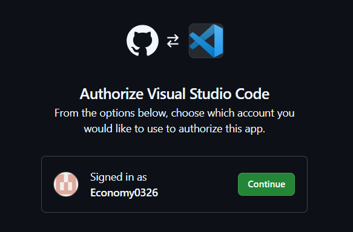
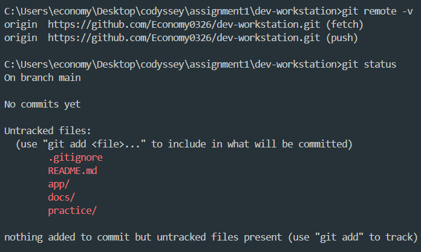

---

## 13. Dockerfile 기반 커스텀 웹 서버 이미지 제작

기존 베이스 이미지로 `nginx:alpine`을 사용하여 정적 웹 페이지를 제공하는 커스텀 이미지를 만들었다.

### 선택한 베이스 이미지

- `nginx:alpine`

### 선택 이유

- 경량 이미지라 빠르게 실행 가능
- 정적 HTML 페이지를 테스트하기 적합
- Dockerfile 구성이 단순하고 검증이 쉬움

### 적용한 커스텀 포인트

- `app/index.html`을 nginx 기본 웹 루트로 복사
- 브라우저에서 커스텀 페이지가 정상적으로 보이는지 확인

### Dockerfile

```dockerfile
FROM nginx:alpine
COPY app/index.html /usr/share/nginx/html/index.html
```

### 빌드 및 실행 예시

```bash
docker build -t dev-workstation-web:1.0 .
docker run -d --name dev-workstation-web -p 8080:80 dev-workstation-web:1.0
docker ps
docker stats --no-stream
```

### 확인한 내용

- `build -t`는 이름:태그를 붙여서 이미지의 이름 지정
- `run -d --name`는 컨테이너 이름 지정 후 백그라운드에서 실행
- `docker stats --no-stream`는 현재 실행중인 컨테이너 리소스 사용량 확인
- `docker ps (-a)`는 현재 실행 중인 컨테이너 목록 (종료된 컨테이너까지 추가로)
- nginx가 정적 파일을 서빙하는 경로의 index.html을 덮어쓴다

### 스크린샷

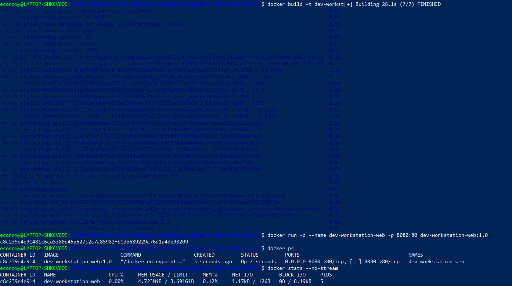
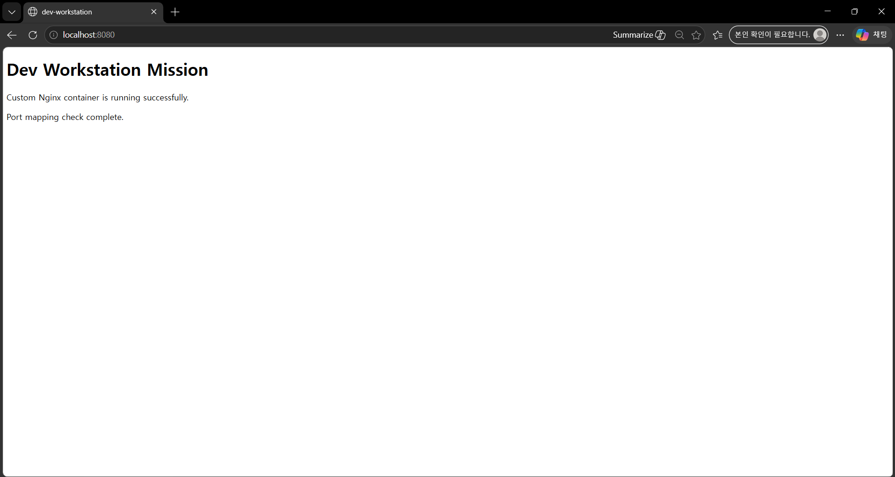

---

## 14. 포트 매핑 및 접속 검증

호스트 포트와 컨테이너 내부 웹 서버 포트를 연결해 브라우저로 접속했다.

### 실행 예시

```bash
docker run -d --name dev-workstation-web -p 8080:80 dev-workstation-web:1.0
```

### 설명

- **호스트 포트**: `8080`
- **컨테이너 포트**: `80`

### 포트 매핑이 필요한 이유

컨테이너 내부 서비스는 기본적으로 외부에서 직접 접근할 수 없다.  
호스트 포트와 연결해야 브라우저에서 `localhost:8080` 형태로 접근할 수 있다.
lsof 명령어로 docker 포트가 어디에 사용중인지 확인할 수 있다.

### 확인한 내용

브라우저 주소창에 `localhost:8080`이 보이는 상태에서 응답 화면을 확인했다.

### 스크린샷


---

## 15. 바인드 마운트 실습

호스트의 파일을 컨테이너에 직접 연결하여, 호스트 파일 수정 내용이 컨테이너에 즉시 반영되는지 확인했다.

### 실행 예시

```bash
docker run -d --name bind-mount-web -p 8081:80 \
-v /mnt/c/Users/economy/Desktop/codyssey/assignment1/dev-workstation/practice/bind-mount/index.html:/usr/share/nginx/html/index.html:ro \
nginx:alpine
```

### 검증 흐름

1. 브라우저에서 `localhost:8081` 접속
2. 호스트의 `practice/bind-mount/index.html` 수정
3. 브라우저 새로고침
4. 변경된 내용이 즉시 반영되는지 확인

### 확인한 내용

- 호스트 파일 수정 후 컨테이너 웹 페이지에 즉시 반영됨
- 바인드 마운트는 호스트 파일과 컨테이너 파일을 직접 연결하는 방식임을 확인

### 스크린샷

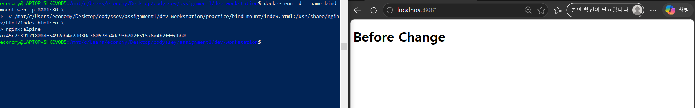
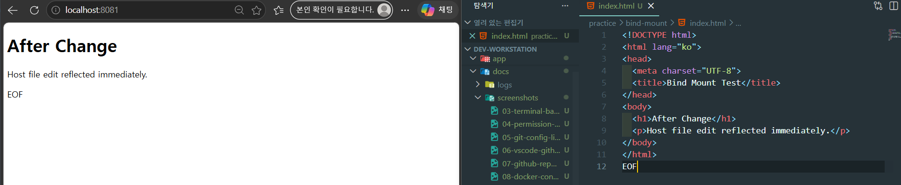

---

## 16. Docker Volume 영속성 검증

Docker volume을 사용해 컨테이너 삭제 후에도 데이터가 유지되는지 확인했다.

### 실행 예시

```bash
docker volume create dev-workstation-volume
docker volume ls

docker run -d --name volume-test-1 -v dev-workstation-volume:/data ubuntu sleep infinity
docker ps

docker exec -it volume-test-1 bash -lc "echo 'volume persistence test' > /data/test.txt && cat /data/test.txt"

docker rm -f volume-test-1
docker ps -a

docker run -d --name volume-test-2 -v dev-workstation-volume:/data ubuntu sleep infinity
docker ps

docker exec -it volume-test-2 bash -lc "cat /data/test.txt"
```

### 확인한 내용

- `docker run -d --name volume-test-1 -v dev-workstation-volume:/data ubuntu sleep infinity`는 ubuntu 이미지를 기반으로 volume-test-1 컨테이너를 백그라운드에서 실행하고, dev-workstation-volume이라는 docker 볼륨을 컨테이너 내부의 /data경로에 마운트했다.
- 첫 번째 컨테이너에서 `/data/test.txt` 생성
- 첫 번째 컨테이너 삭제 후 동일한 volume을 연결한 두 번째 컨테이너 실행
- 두 번째 컨테이너에서 같은 파일 내용 `volume persistence test` 확인
- 이를 통해 컨테이너는 삭제되어도 volume 데이터는 유지된다는 점을 검증했다

### 바인드 마운트와의 차이

- 바인드 마운트는 호스트의 실제 파일이나 폴더를 직접 연결한다.
- Docker volume은 Docker가 관리하는 저장소를 컨테이너에 연결한다.
- 데이터 영속성 측면에서는 Docker volume이 더 일반적인 방식이다.

### 스크린샷

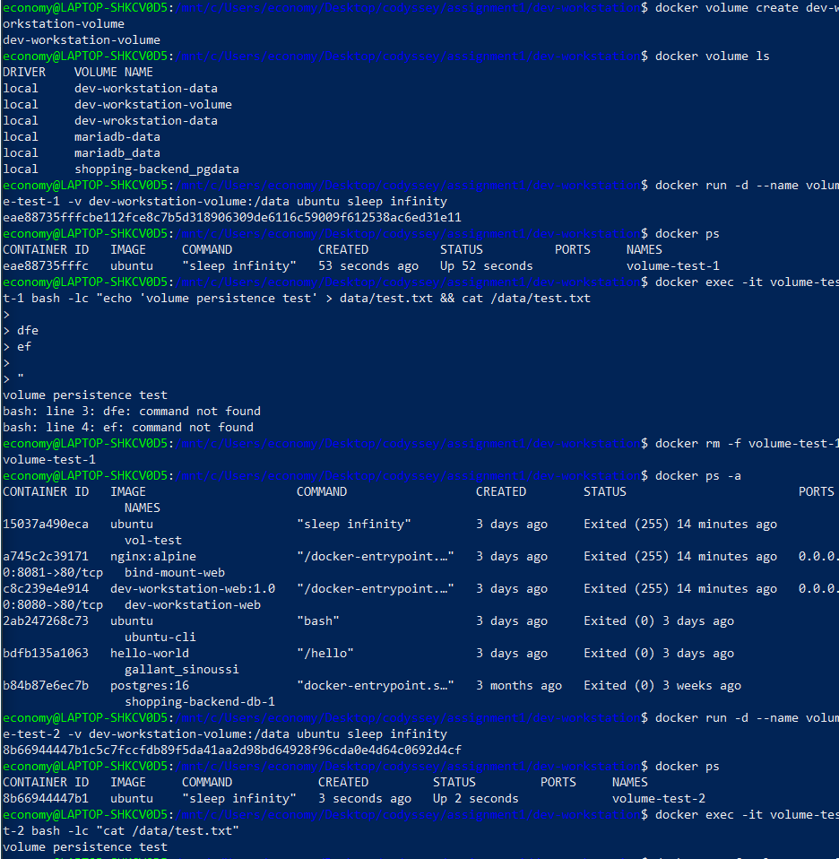

---

## 17. Git과 GitHub의 역할 차이

### Git

로컬 환경에서 소스코드 변경 이력을 관리하는 버전관리 시스템

### GitHub

Git 저장소를 원격으로 보관하고 협업할 수 있게 해주는 플랫폼

### 정리

- **Git**은 로컬 버전관리 도구
- **GitHub**는 원격 저장소 및 협업 플랫폼

---

## 18. `.gitignore` 설정

프로젝트 루트에 `.gitignore`를 작성해 운영체제 생성 파일, 로그 파일, 환경 변수 파일, 에디터 설정 파일, 임시 파일이 원격 저장소에 포함되지 않도록 관리했다.

### `.gitignore` 내용

```gitignore
# OS files
.DS_Store
Thumbs.db

# Logs
*.log

# Environment files
.env
.env.*

# VS Code
.vscode/

# Python cache
__pycache__/
*.pyc

# Temporary files
*.tmp
*.swp
```

### 적용 이유

- `.DS_Store`, `Thumbs.db`: 운영체제 잡파일 제외
- `*.log`: 로그 파일 제외
- `.env`, `.env.*`: 민감한 환경 설정 파일 제외
- `.vscode/`: 개인 로컬 에디터 설정 제외
- `__pycache__/`, `*.pyc`: 파이썬 캐시 파일 제외
- `*.tmp`, `*.swp`: 임시 파일 제외

### 주의할 점

- `.gitignore`는 앞으로 추적하지 않을 파일을 관리하는 설정이다.
- 이미 Git이 추적 중인 파일은 `.gitignore`에 추가해도 자동으로 제거되지 않는다.
- 민감정보가 이미 커밋된 경우에는 별도로 삭제하고 필요 시 재발급해야 한다.

---

## 19. 보안 및 개인정보 보호

과제 수행 중 민감정보가 저장소와 스크린샷에 노출되지 않도록 주의했다.

### 적용 내용

- 비밀번호, 토큰, 인증 코드, 개인키를 README와 스크린샷에 포함하지 않음
- GitHub 로그인 증거는 남기되 인증정보는 노출하지 않음
- README에 이메일 주소는 마스킹해서 기재
- `.gitignore`를 활용해 불필요한 파일과 환경 의존 파일이 저장소에 포함되지 않도록 관리

---

## 20. 검증 방법 요약

각 항목은 아래 명령과 결과로 검증했다.

- **터미널 기본 조작**: `mkdir`, `cd`, `touch`, `cp`, `mv`, `rm`, `pwd`, `ls -la`
- **파일 내용 확인**: `cat`
- **권한 변경**: `ls -l`, `ls -ld`, `chmod`
- **Docker 점검**: `docker --version`, `docker info`
- **이미지/컨테이너 확인**: `docker images`, `docker ps`, `docker ps -a`
- **로그/리소스 확인**: `docker logs`, `docker stats --no-stream`
- **컨테이너 실행**: `docker run`
- **이미지 빌드**: `docker build`
- **포트 매핑**: `docker run -p`
- **바인드 마운트**: `docker run -v`
- **볼륨 영속성**: `docker volume create`, `docker run -v`, `docker exec`, `docker rm`
- **Git 설정**: `git config --global`, `git config --list`

---

## 21. 트러블슈팅

### 1) 바인드 마운트 수정 과정에서 브라우저에 불필요한 문자열이 출력된 문제

#### 문제

바인드 마운트 실습 중 브라우저 화면에 의도하지 않은 문자열이 함께 표시되었다.

#### 원인

HTML 파일 편집 과정에서 불필요한 문자열이 실제 파일 내용에 포함되었기 때문이다.

#### 확인

브라우저에서 예상하지 않은 텍스트가 그대로 렌더링되는 것을 확인했다.  
VSCode에서 `index.html` 내용을 다시 확인했다.

#### 해결

파일 내용을 수정하고 브라우저를 새로고침해 정상 반영되는 것을 확인했다.

#### 배운 점

바인드 마운트는 호스트 파일과 직접 연결되기 때문에 호스트 파일의 오타나 불필요한 내용도 즉시 결과에 반영된다.

---

### 2) `docker exec` 입력 중 따옴표가 꼬여 추가 입력이 이어진 문제

#### 문제

volume 영속성 실습 중 아래 명령 입력 과정에서 프롬프트가 `>` 형태로 바뀌며 원하지 않은 문자열이 추가 입력되었다.

```bash
docker exec -it volume-test-1 bash -lc "echo 'volume persistence test' > /data/test.txt && cat /data/test.txt"
```

#### 원인

큰따옴표 또는 작은따옴표가 정상적으로 닫히지 않아 셸이 다음 입력을 같은 문자열의 일부로 인식했기 때문이다.

#### 확인

- 프롬프트가 `$` 대신 `>`로 바뀌었다.
- 이후 `command not found` 메시지가 발생했다.

#### 해결

명령을 다시 정확하게 입력해 실행했다.  
최종적으로 두 번째 컨테이너에서 `cat /data/test.txt` 결과가 정상 출력되는 것을 확인했다.

#### 배운 점

WSL/bash 환경에서는 따옴표가 닫히지 않으면 셸이 계속 입력을 기다릴 수 있으므로 긴 명령은 복붙 전 따옴표 짝을 먼저 확인해야 한다.

---

## 22. 첨부 스크린샷 목록

- `docs/screenshots/03-terminal-basic-commands.PNG`
- `docs/screenshots/03-terminal-cat.PNG`
- `docs/screenshots/04-permission-file-dir-before-after.PNG`
- `docs/screenshots/05-git-config-list.PNG`
- `docs/screenshots/06-vscode-github-login.PNG`
- `docs/screenshots/07-github-repo-linked.PNG`
- `docs/screenshots/08-docker-connect.PNG`
- `docs/screenshots/08-docker-connect-(2).PNG`
- `docs/screenshots/09-ubuntu-container.PNG`
- `docs/screenshots/09-ubuntu-container-(2).PNG`
- `docs/screenshots/09-ubuntu-helloworld.PNG`
- `docs/screenshots/09-ubuntu-log-resource.PNG`
- `docs/screenshots/10-dockerfile.PNG`
- `docs/screenshots/11-index-html.PNG`
- `docs/screenshots/12-before-change.PNG`
- `docs/screenshots/12-after-change.PNG`
- `docs/screenshots/13-volume-persistent.PNG`

---

## 23. 느낀 점

이번 과제를 통해 개발은 코드를 작성하는 순간이 아니라, 실행 환경을 재현 가능하게 만드는 단계부터 시작된다는 점을 배웠다.  
특히 Docker를 사용하면서 이미지와 컨테이너의 차이, 포트 매핑의 필요성, 바인드 마운트와 볼륨의 차이를 직접 확인할 수 있었다.  
또한 Git과 GitHub를 함께 사용하면서 로컬 버전관리와 원격 협업의 역할 차이도 실습으로 이해할 수 있었다.
